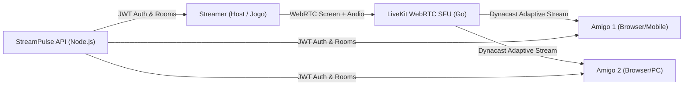

# 🚀 StreamPulse — Plataforma de Streaming P2P/SFU para Amigos

**StreamPulse** é uma plataforma de streaming de tela, jogos e watch-party de **ultra-baixa latência (< 200ms)** inspirada no estilo *Discord Go Live*, construída sobre tecnologias open-source consolidadas (**LiveKit SFU / WebRTC**, **React 19**, **Tailwind CSS**, **Node.js** e **Docker**).

---

## 🌟 Principais Recursos

- ⚡ **Ultra-Baixa Latência (< 200ms)**: Streaming em tempo real via WebRTC SFU com aceleração de hardware (VP9 / H.264 / AV1).
- 🎮 **Feito para Jogos (60 FPS & Stereo Loopback)**:
  - Presets de 720p, 1080p, 1440p (2K) e 4K a 60 FPS.
  - Bitrate configurável (de 2 Mbps até 20 Mbps).
  - Captura direta do áudio do sistema/jogo + microfone integrado.
- 🔗 **Zero Instalação para Espectadores**: Amigos entram direto pelo link do navegador (`https://seu-dominio/?room=jogatina`), funcionando no PC, celular ou tablet.
- 💬 **Interatividade ao Vivo**:
  - Chat em tempo real via WebRTC DataChannels.
  - Soundboard e reações com emojis animados e confetes.
  - Lista de amigos com indicador de voz ativa (*voice activity detection*).
- 📊 **Stream Diagnostics HUD**: Overlay em tempo real com estatísticas de latência (RTT em ms), taxa de quadros (FPS), bitrate (Mbps), perda de pacotes (%) e codec ativo.
- 🔒 **Salas Protegidas**: Suporte a senha opcional por sala.
- 🛡️ **Alta Disponibilidade e Resiliência**: Reconexão automática com backoff exponencial, Dynacast inteligente (economiza upload do streamer transmitindo apenas o que cada espectador precisa) e suporte a TURN/ICE fallback.

---

## 🏗️ Arquitetura do Sistema



---

## 🚀 Como Executar

### Opção 1: Usando Docker Compose (Recomendado para Produção/Turnkey)

Com apenas um comando, todos os serviços (LiveKit SFU + API + Frontend) sobem automaticamente:

```bash
docker compose up -d
```

- **Frontend / Player**: `http://localhost:3000`
- **Backend API**: `http://localhost:3001`
- **LiveKit SFU**: `ws://localhost:7880`

Para parar:
```bash
docker compose down
```

---

### Opção 2: Modo de Desenvolvimento Local (Node.js)

1. **Inicie o servidor LiveKit** (via Docker ou binário):
   ```bash
   docker run --rm -p 7880:7880 -p 7881:7881 -p 50000-50100:50000-50100/udp livekit/livekit-server --dev
   ```

2. **Inicie a API e o Frontend simultaneamente**:
   ```bash
   npm run dev
   ```

3. Acesse `http://localhost:3000` no seu navegador.

---

## 🌐 Como Jogar com Amigos Fora da Sua Rede Local (Sem Abrir Portas)

1. **Cloudflare Tunnel (100% Grátis)**:
   - Permite criar uma URL pública segura com SSL (`https://stream.seudominio.com`) sem precisar de IP público ou abrir portas no roteador.
   ```bash
   cloudflared tunnel --url http://localhost:3000
   ```

2. **Tailscale / ZeroTier (VPN Mesh Privada)**:
   - Conecte você e seus amigos na mesma rede VPN privada e acesse pelo IP do Tailscale com latência direta peer-to-peer.

3. **Deploy em VPS (Hetzner / Oracle Cloud Free Tier / AWS)**:
   - Execute o `docker compose up -d` na VPS e aponte seu domínio.

---

## 📂 Estrutura do Projeto

```
quick-tesla/
├── client/                     # Aplicação Frontend (Vite + React 19 + Tailwind CSS)
│   ├── src/
│   │   ├── components/
│   │   │   ├── ChatPanel.tsx        # Chat ao vivo, reações e lista de amigos
│   │   │   ├── ControlsBar.tsx      # Barra de controles (Mic, Áudio, Compartilhamento)
│   │   │   ├── Lobby.tsx            # Criação/Entrada de salas e teste de microfone
│   │   │   ├── ScreenShareModal.tsx # Seletor de 60 FPS, 1080p/4K, Bitrate e Áudio
│   │   │   ├── StreamHUD.tsx        # Diagnósticos técnicos de WebRTC ao vivo
│   │   │   └── VideoPlayer.tsx      # Player de vídeo com PiP, tela cheia e som
│   │   ├── hooks/
│   │   │   └── useLiveKit.ts        # Gerenciador WebRTC com LiveKit
│   │   ├── types.ts                 # Tipos e definições
│   │   ├── App.tsx                  # Componente raiz unificado
│   │   └── index.css                # Estilos modernos escuros
│   ├── Dockerfile
│   └── nginx.conf
├── server/                     # Backend de Token e Orquestração de Salas
│   ├── src/
│   │   └── index.ts                 # Endpoints /api/token, /api/rooms e autenticação JWT
│   ├── Dockerfile
│   └── package.json
├── docker-compose.yml          # Orquestração do LiveKit SFU + API + Frontend
├── livekit.yaml                # Configuração de alta performance e baixa latência do LiveKit
└── package.json                # Scripts centralizados de desenvolvimento
```
