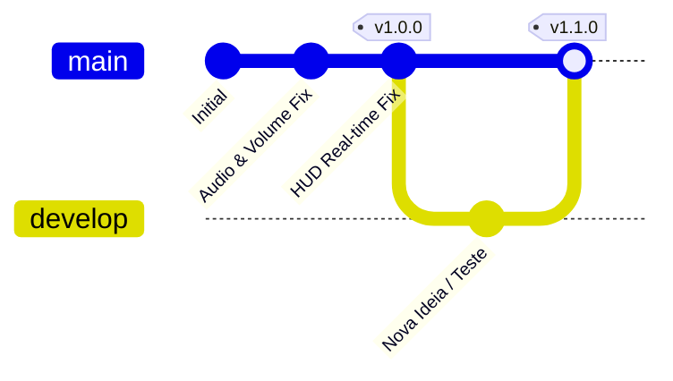

# 🏷️ Guia de Versionamento & Segurança — Põe na Tela!

Este guia foi criado para garantir que você possa testar novas ideias, criar funcionalidades e, caso qualquer coisa dê errado, **voltar para a versão anterior em segundos sem perder nada**.

---

## 🏛️ Estrutura de Branches & Tags Criada



1. **`main` (Produção Oficial)**:
   - Contém **apenas código 100% testado e homologado**.
   - **Frontend:** Produção na Vercel.
   - **Backend:** Porta `3001` no PM2 (`backend`), acessível via `https://api.194.61.238.98.sslip.io`.
   - Deploy automático disparado apenas por pushes na `main`.
2. **`develop` (Ambiente de Staging & Testes Contínuos)**:
   - Onde novas modificações e experimentos são desenvolvidos e testados.
   - **Frontend:** Preview Deployments automáticos na Vercel.
   - **Backend:** Porta `3002` no PM2 (`backend-dev`), acessível via `https://api-dev.194.61.238.98.sslip.io`.
   - Deploy automático disparado apenas por pushes na `develop`.
3. **Tags (`v1.0.0`, `v1.8.7`, etc.)**:
   - Pontos de restauração permanentes de versões estáveis.

---

## 🛠️ Como Fazer Novas Modificações com Segurança

### 1. Criar uma branch para a nova funcionalidade
Antes de alterar o código, crie uma branch isolada para o teste:

```powershell
# Cria e entra na branch da nova funcionalidade
git checkout -b feat/minha-nova-ideia
```

### 2. Testar e Comitar
Faça suas alterações e teste localmente com:
```powershell
npm run dev
```

Quando terminar:
```powershell
git add .
git commit -m "feat: adicionei nova funcionalidade x"
```

### 3. Subir para Produção (`main`) quando tudo estiver perfeito
```powershell
git checkout main
git merge feat/minha-nova-ideia
git push origin main
```

---

## 🚨 Como Voltar para a Versão Anterior (Rollback de Emergência)

### Cenário 1: "Fiz besteira no código e quero desfazer tudo agora sem salvar"
```powershell
git restore .
git clean -fd
```
*(Isso limpa todos os arquivos modificados e volta ao estado do último commit imediatamente)*.

---

### Cenário 2: "Fiz alterações em uma branch de teste e quero voltar para a versão estável (v1.0.0)"
```powershell
# Volta para a branch principal estável
git checkout main
```
Ou, se quiser ir exatamente para o ponto de restauração `v1.0.0`:
```powershell
git checkout v1.0.0
```

---

### Cenário 3: "Enviei um commit com erro para a `main` e a Vercel quebrou. Como voltar?"
Para reverter o último commit de forma segura sem alterar o histórico:

```powershell
# Cria um commit que desfaz exatamente o que o commit anterior fez
git revert HEAD --no-edit
git push origin main
```
*(A Vercel atualizará imediatamente de volta para a versão que funcionava)*.

---

### Cenário 4: "Quero forçar a `main` a voltar exatamente para a tag `v1.0.0`"
```powershell
git checkout main
git reset --hard v1.0.0
git push origin main --force
```

---

## 📌 Criando Novos Pontos de Restauração (Tags)

Sempre que terminar um conjunto de melhorias que ficou perfeito e estável, crie uma nova Tag com a versão:

```powershell
# Exemplo para versão 1.1.0
git tag -a v1.1.0 -m "Release v1.1.0: Descrição das novidades"
git push origin v1.1.0
```

---

## 📋 Tabela de Comandos Rápidos

| Objetivo | Comando |
| :--- | :--- |
| **Ver versão atual e histórico** | `git log --oneline -n 5` |
| **Listar pontos de restauração (tags)** | `git tag` |
| **Ver em qual branch estou** | `git branch` |
| **Descartar alterações locais** | `git restore .` |
| **Voltar para a versão 1.0.0** | `git checkout v1.0.0` |
| **Criar ponto de restauração** | `git tag -a v1.1.0 -m "mensagem" && git push origin v1.1.0` |
